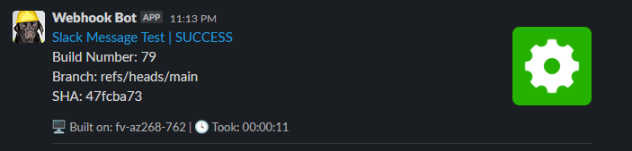

# build-report-slack-message
Action that sends a message containing the result of your Workflow run, build number, branch, commit SHA, machine that it was run on and duration. You can also send extra data and display anything else you want.

## Message Examples



## Calling Example
```
      - name: Call Slack Messaging
        if: always()
        uses: paulogodinho-actions/build-report-slack-message@v1
        with:
          webhook-url: ${{ secrets.TESTING_WEBHOOK }}
```


## Usage
The only required parameter is `webhook-url` all other parameters are inferred from the job that is running, **but they can be passed to the actions if you have custom values**

### Parameters:
### Required
- `webhook-url` - [Required] Webhook url created in Slack App, more info on how to create it, bellow.
### Optional
- `title` - Title of the message, if not set the name of the workflow will be used. SUCCESS | FAILURE | CANCELLED is apprended to the end of the title.
- `status` - The status you want to display, if not set the status is the one of the **job**. The accepted values are: `success`, `failure` and `cancelled`.
- `branch` - The branch were the current workflow is running, if not set the branch displayed will be the current one.
- `sha` - SHA of the commit, if not set the SHA displayed will be the current commit one.
- `machine-name` - Name of the machine that run this job, if not set the value will come from `os.hostname()` function.
- `extra-info` - More data you want to put into the message, to create new lines please use `/n` instead of the regular `\n`.
- `image` - Image to be displayed at the right of the message, they are automatically colored, Green for SUCESS, Red for FAILURE, and Blue for CANCELLED. The icon comes from [RemixIcons](https://remixicon.com/), if you want the Android logo to be displayed on you message, set this value to `android-fill`, to set it to the App Store logo set to `app-store-line`. Please check [RemixIcons](https://remixicon.com/) for the complete list of supported Icons. If not set the image used will be `settings-5-fill`

## Creating Slack Webhooks
You can follow this guide on how to create your own webhooks: [Sending messages using Incoming Webhooks](https://api.slack.com/messaging/webhooks)

    WARNING: Always save your webhook as a SECRET, never add it directly to you workflow, even if they are one way only you can expose yourself to phishing attacks by allowing attackers to send messages to your Slack.

## About the Images used in this Actions
The images com from the repository [paulogodinho-actions/build-status-icons](https://github.com/paulogodinho-actions/build-status-icons) where every [RemixIcons](https://remixicon.com/) icon was rendered with green, red and blue using Node. This is required because Slack unfortunatelly does not support SVG images, which would allow the coloring to be done on the fly inside the action.

<br>

# Any Suggestion? Please message me at [@paulogodinho](https://twitter.com/paulohgodinho)